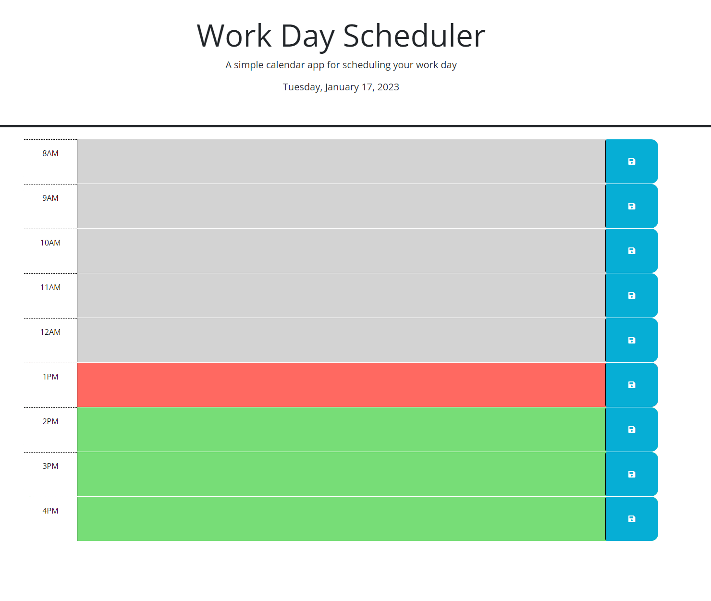

# Planner
This project was designed to help employees with busy work schedules to map out their day but imputing reminders and appointments.

By David Lee

## Technologies Used
* HTML
* CSS
* JavaScript
* Dayjs
* Jquery

## User Story
```
AS AN employee with a busy schedule
I WANT to add important events to a daily planner
SO THAT I can manage my time effectively
```
## Acceptance Criteria
```
GIVEN I am using a daily planner to create a schedule
WHEN I open the planner
THEN the current day is displayed at the top of the calendar
WHEN I scroll down
THEN I am presented with timeblocks for standard business hours
WHEN I view the timeblocks for that day
THEN each timeblock is color coded to indicate whether it is in the past, present, or future
WHEN I click into a timeblock
THEN I can enter an event
WHEN I click the save button for that timeblock
THEN the text for that event is saved in local storage
WHEN I refresh the page
THEN the saved events persist
```
## Usage

Utilizing the site is simple!

Load the site by copying and pasting the link on to a browser.
* https://kpxcrew.github.io/planner/

In the time slot, click the box and enter text!
Grey signifies the past
Red signifies the present
Green signifies the future

## Screenshots


## Sources

https://www.w3schools.com/js/default.asp
* I used this to understand Javascript better.

https://ucb.bootcampcontent.com/UCB-Coding-Bootcamp/UCB-VIRT-FSF-PT-11-2022-U-LOLC
* I used this to review over the weeks modules and lessons.

https://javascriptbook.com/
* An excellent reference to javascript and its components.

https://stackoverflow.com/
* A community of developers able to help and debug common issues i came across.

https://day.js.org/docs/en/display/format
* A resource being able to provide proper formating for dates and time